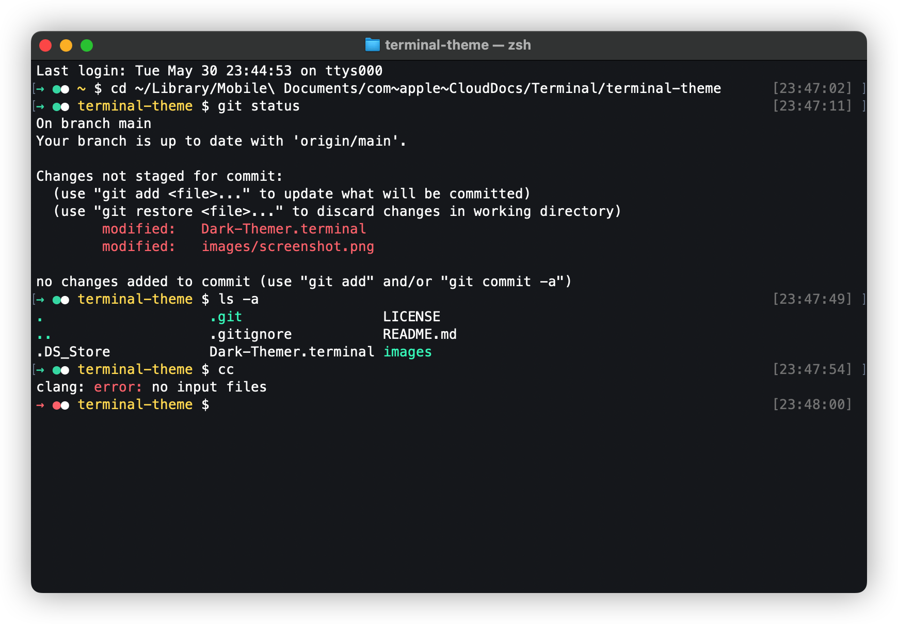

# Dark Themer

> A dark theme for macOS Terminal.app



## 📥 Download

**Install using Git**

```shell
$ git clone https://github.com/toFrankie/terminal-theme.git
```

**Install manually**

Download [GitHub ZIP](https://github.com/toFrankie/terminal-theme/archive/refs/heads/main.zip) and unzip them.

## ⚙️ Activating

1. Choose Terminal > Preferences, then click Profiles.
2. Click the Action pop-up menu, choose Import.
3. Select the `Dark-Themer.terminal` file, then click Open.
4. Click Default. ❤️

## 🎨 Color Palette

| Palette    | Hex       | Alpha | 🧪                                                             |
| ---------- | --------- | ----- | -------------------------------------------------------------- |
| Background | `#1C1F24` | `1`   |  |
| Text       | `#FEFEFD` | `1`   |  |
| Blod Text  | `#FEFEFD` | `1`   |  |
| Selection  | `#4774F6` | `0.5` |   |
| Black      | `#1D1E24` | `1`   |       |
| Red        | `#FF6767` | `1`   |         |
| Green      | `#57BF9C` | `1`   |       |
| Yellow     | `#F8D36B` | `1`   |      |
| Blue       | `#65A1F8` | `1`   |        |
| Magenta    | `#D85888` | `1`   |     |
| Cyan       | `#6AE3B9` | `1`   |        |
| White      | `#FEFEFD` | `1`   |       |
